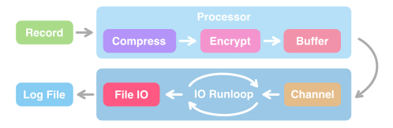
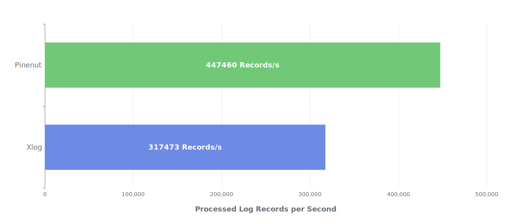

<div align="center">


# Pinenut (松子) Log

<div align="center">
<strong>

[中文文档](./README-CN.md) ・ [English](./README.md) 

</strong>
</div>

一款性能极高的跨平台端上日志系统 (将支持 iOS、Android 和桌面端)，采用 Rust 编写。

[](https://codecov.io/gh/TangentW/Pinenut)
[](https://crates.io/crates/pinenut-log)
[](https://cocoapods.org/pods/Pinenut)

</div>

## 系统概述



### 压缩

Pinenut 支持日志流式压缩（边记录日志边压缩），其使用了 `Zstandard (即 zstd)` 这款高性能的压缩算法，在压缩率和压缩速度上拥有比较好的平衡。

### 加密

Pinenut 在日志记录过程中采用了 `AES 128` 算法进行对称加密。为了避免对称加密的密钥直接嵌入客户端代码中，Pinenut 使用 `ECDH` 进行对称加密密钥的协商 (不选用 RSA，因为其密钥过长)。所以在 Logger 初始化时，我们不用写死对称加密密钥，只需拟定 ECDH 公钥即可。这样客户端代码就不会暴露对称加密密钥。

Pinenut 采用了 `secp256r1` 椭圆曲线进行 ECDH 对称加密密钥协商，你可以自行根据此曲线生成加密私钥和公钥，或使用 Pinenut 内建的命令行工具生成：`pinenut-cli`（具体使用请看下文）。

### 缓存

为了降低 IO 频次，Pinenut 在进行日志文件写入前会对数据进行缓存。考虑到客户端程序可能会意外退出（如程序崩溃闪退），Pinenut 使用了 `mmap` 作为缓存支持。当程序意外退出时，操作系统仍能帮助持久化缓存数据，在下一次 Logger 初始化时，缓存数据将自动读取并回写到日志文件中。

不仅如此，为了提升缓存的读写性能，Pinenut 还实现了`双缓冲 (double-buffering)`系统，也避免了异步的 IO 对当前日志记录所在线程造成性能影响。

### 日志提取

使用 Pinenut，我们不需要为了提取日志而自行遍历检索目录中所有的日志文件，其提供了便利的日志提取能力，并支持按分钟级别粒度的时间范围提取（如提取 13:45 - 14:13 期间的日志）。

### 日志解析

Pinenut 日志文件的内容是经过编码、压缩和加密过后的特殊二进制序列，我们可以使用 Pinenut 提供的解析能力来对日志文件进行解析（解密、解压、解码）。

## 依赖集成

Pinenut 目前提供了 `Swift` 和 `Rust` 语言的 API，在后续也会支持 `Kotlin` 语言。

### Swift Package Manager

```swift
.package(url: "https://github.com/TangentW/Pinenut.git", from: "0.0.1")
```

### CocoaPods

```ruby
pod 'Pinenut'
```

### Rust Cargo

```toml
[dependencies]
pinenut-log = 0.0.1
```

## 基本使用

无论在哪种语言上，Pinenut 的 API 通常都是十分相似的。

### 初始化 Logger

Pinenut 使用 `Logger` 实例进行日志记录。在初始化 `Logger` 前，我们需要先拟定其标识符 (identifier) 以及日志文件所存放的目录路径 (directory)，构造出 `Domain` 结构。

`Logger` 支持若干的自定义配置，我们可以通过显式指定 `Config` 结构来进行定制。更多详情请查看 Pinenut 的 API 文档。

<details open>
<summary><b>Swift Code</b></summary>

```swift
let domain = Domain(identifier: "MyApp", directory: "/path/to/dir")
let config = Config(key: "Public Key Base64", compressionLevel: 10)
let logger = Logger(domain: domain, config: config)
```

</details>

<details open>
<summary><b>Rust Code</b></summary>

```rust
let domain = Domain::new("MyApp".into(), "/path/to/dir".into());
let config = Config::new().key_str(Some("Public Key Base64")).compression_level(10);
let logger = Logger::new(domain, config);
```

</details>

### 记录日志

在 Pinenut 中，`Record` 代表单条日志的数据模型，我们可以构造出 Record 实例然后调用 Logger 的 `log` 方法进行日志记录。

<details open>
<summary><b>Swift Code</b></summary>

`Swift` API 也提供了更为便利的日志记录方式。

```swift
logger.log(.info, "Hello World")
logger.log(.debug, tag: "MyModule", "Debug Message")

// `Logger` 提供了针对不同日志等级的 API
logger.info("Hello World")
logger.error("Error message")
logger.debug(tag: "MyModule", "Debug message")

// 将当前被缓存的全部 Record 异步 flush 出去
logger.flush()
```

</details>

<details open>
<summary><b>Rust Code</b></summary>

在 `Rust` API 中，Record 可以通过构建器模式 (Builder pattern) 进行构造：

```rust
// 构造 `Meta` 和 `Record` 数据模型
let meta = Meta::builder().level(Level::Info).build();
let record = Record::builder().meta(meta).content("Hello World").build();
logger.log(&record);

// 将当前被缓存的全部 Record 异步 flush 出去
logger.flush();
```

</details>

更多详情请查看 Pinenut 的 API 文档。

### 提取日志

我们可以通过调用 `extract` 方法来将特定时间范围内的日志提取出来，并自动写入到指定的文件中，而提取的时间是可以精确到分钟级别粒度的。

<details open>
<summary><b>Swift Code</b></summary>

```swift
let domain = Domain(identifier: "MyApp", directory: "/path/to/dir")
let range = Date(timeIntervalSinceNow: -1800)...Date()

do {
    try Logger.extract(domain: domain, timeRange: range, destPath: "/path/to/destination")
} catch {
    print("Error: \(error)")
}
```

</details>

<details open>
<summary><b>Rust Code</b></summary>

```rust
let domain = Domain::new("MyApp".into(), "/path/to/dir".into());
let now = chrono::Utc::now();
let range = now.sub(Duration::from_secs(1800))..=now;

if let Err(err) = pinenut_log::extract(domain, range, "/path/to/destination") {
    println!("Error: {err}");
}
```

</details>

注意：提取出来的日志文件其内容仍然是经过编码、压缩和加密的二进制序列，我们需要进行解析才能看到易读的日志文本内容。

### 解析日志

使用带 `parse` 前缀的相关 API 可以进行日志的解析，得到易读的日志文本内容。你甚至可以自定义自己的文本格式化逻辑，详情请查看 Pinenut 的 API 文档。

<details open>
<summary><b>Swift Code</b></summary>

```swift
do {
    try Logger.parse(path: path, to: dest, secretKey: secretKey)
} catch {
    print("Error: \(error)")
}
```

</details>

<details open>
<summary><b>Rust Code</b></summary>

```rust
// 指定 `DefaultFormater` 作为日志文本格式化器
if let Err(err) = pinenut_log::parse_to_file(&path, &output, secret_key, DefaultFormatter) {
    println!("Error: {err}");
}
```

</details>

或者可以直接使用内建的命令行工具 `pinenut-cli` 进行日志解析：

```
$ pinenut-cli parse ./my_log.pine \
    --output ./plain.log          \
    --secret-key XXXXXXXXXXX
```

### 生成加密密钥

在记录日志或解析日志前，你需要准备好一对公钥和私钥。公钥用于初始化 Logger，而私钥则用于自己解析日志。或者你可以不指定公钥私钥，从而不进行日志的加密。

你可以自行生成 `secp256r1` 椭圆曲线的公钥私钥对，或者可以直接使用内建的命令行工具 `pinenut-cli` 生成：

```
$ pinenut-cli gen-keys
```

## 性能验证

Pinenut 的部分设计灵感来源于 Xlog，这里也对其两者进行性能的比对。

为了避免两者所使用的压缩库差异导致结果数据失去可比性，考虑到它们都支持 zstd，所以性能验证将在两者都使用同一版本的 zstd 库 (v1.5.5) 且压缩等级为 10 的前提下进行。

*验证运行在 iPhone 12 上，系统为 iOS 15.5。*



| 日志库  | 每秒能处理的日志条目数 (速度) |
| :-----: | :---------------------------: |
| Pinenut |            447460             |
|  Xlog   |            317473             |

## 待办项

- [ ] 日志等级过滤
- [ ] 提供 Kotlin API

## 开源许可

Pinenut 基于 MIT 开源许可协议，更多详情请查看 LICENSE 文件。 
