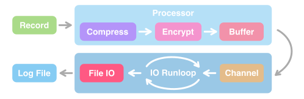

<div align="center">


# Pinenut Log

<div align="center">
<strong>

[中文文档](./README-CN.md) ・ [English](./README.md) 

</strong>
</div>

An extremely high performance logging system for clients (iOS, Android, Desktop), written in Rust. 

[](https://codecov.io/gh/TangentW/Pinenut)
[](https://crates.io/crates/pinenut-log)
[](https://cocoapods.org/pods/Pinenut)

</div>

## Overview



### Compression

Pinenut supports streaming log compression, it uses the `Zstandard (aka zstd)`, a high performance compression algorithm that has a good balance between compression rate and speed.

### Encryption

Pinenut uses the `AES 128` algorithm for symmetric encryption during logging. To prevent embedding the symmetric key directly into the code, Pinenut uses `ECDH` for key negotiation (RSA is not used  because its key are too long). When initializing the Logger, there is no need to provide the symmetric encryption key, instead the ECDH public key should be passed.

Pinenut uses `secp256r1` elliptic curve for ECDH. You can generate the secret and public keys for encryption yourself, or use Pinenut's built-in command line tool: `pinenut-cli`.

### Buffering

In order to minimize IO frequency, Pinenut buffers the log data before writing to the file. Client programs may exit unexpectedly (e.g., crash), Pinenut uses `mmap` as buffer support, so that if the program unexpectedly exits, the OS can still help to persist the buffered data. The next time the Logger is initialized, the buffered data is automatically read and written back to the log file.

In addition, Pinenut implements a `double-buffering` system to improve buffer read/write performance and prevent asynchronous IOs from affecting logging of the current thread.

### Extraction

With Pinenut, we don't need to retrieve all the log files in the directory to extract logs, it provides convenient extraction capabilities and supports extraction in time ranges with minute granularity.

### Parsing

The content of Pinenut log files is a special binary sequence after encoding, compression and encryption, and we can parse the log files using the parsing capabilities provided by Pinenut.

## Installation

Pinenut provides APIs for these languages: `Swift`, `Rust`. `Kotlin` will be supported in the future.

### Swift Package Manager

```swift
.package(url: "https://github.com/TangentW/Pinenut.git", from: "0.0.1")
```

### CocoaPods

```ruby
pod 'Pinenut'
```

### Rust Cargo

```toml
[dependencies]
pinenut-log = 0.0.1
```

## Usage

Pinenut's APIs are generally similar regardless of the language used.

### Logger Initialization

Pinenut uses a `Logger` instance for logging. Before we initialize the Logger, we need to pass in the logger identifier and the path to the directory where the log files are stored to construct the `Domain` structure. 

We can customize the Logger by explicitly specifying `Config`, see the API documentation for details.

<details open>
<summary><b>Swift Code</b></summary>

```swift
let domain = Domain(identifier: "MyApp", directory: "/path/to/dir")
let config = Config(key: "Public Key Base64", compressionLevel: 10)
let logger = Logger(domain: domain, config: config)
```

</details>

<details open>
<summary><b>Rust Code</b></summary>

```rust
let domain = Domain::new("MyApp".into(), "/path/to/dir".into());
let config = Config::new().key_str(Some("Public Key Base64")).compression_level(10);
let logger = Logger::new(domain, config);
```

</details>

### Logging

Just construct the `Record` and call the `log` method. 

<details open>
<summary><b>Swift Code</b></summary>

`Swift` provides more convenient APIs for logging:

```swift
logger.log(.info, "Hello World")
logger.log(.debug, tag: "MyModule", "Debug Message")

// `Logger` provides APIs for logging levels.
logger.info("Hello World")
logger.error("Error message")
logger.debug(tag: "MyModule", "Debug message")

// Flushes any buffered records asynchronously.
logger.flush()
```

</details>

<details open>
<summary><b>Rust Code</b></summary>

Records can be constructed in `Rust` via the Builder pattern:

```rust
// Builds `Meta` & `Record`.
let meta = Meta::builder().level(Level::Info).build();
let record = Record::builder().meta(meta).content("Hello World").build();
logger.log(&record);

// Flushes any buffered records asynchronously.
logger.flush();
```

</details>

See the API documentation for details.

### Extraction

Just call the `extract` method to extract the logs for the specified time range (with minute granularity) and write them to the destination file.

<details open>
<summary><b>Swift Code</b></summary>

```swift
let domain = Domain(identifier: "MyApp", directory: "/path/to/dir")
let range = Date(timeIntervalSinceNow: -1800)...Date()

do {
    try Logger.extract(domain: domain, timeRange: range, destPath: "/path/to/destination")
} catch {
    print("Error: \(error)")
}
```

</details>

<details open>
<summary><b>Rust Code</b></summary>

```rust
let domain = Domain::new("MyApp".into(), "/path/to/dir".into());
let now = chrono::Utc::now();
let range = now.sub(Duration::from_secs(1800))..=now;

if let Err(err) = pinenut_log::extract(domain, range, "/path/to/destination") {
    println!("Error: {err}");
}
```

</details>

Note: The content of the extracted file is still a binary sequence that has been encoded, compressed, and encrypted. We need to parse it to see the log text content that is easy to read.

### Parsing

You can use the `parse` function for log parsing, **and you can specify the format of the log parsed text**. See the API documentation for details.

<details open>
<summary><b>Swift Code</b></summary>

```swift
do {
    try Logger.parse(path: path, to: dest, secretKey: secretKey)
} catch {
    print("Error: \(error)")
}
```

</details>

<details open>
<summary><b>Rust Code</b></summary>

```rust
// Specifies the `DefaultFormater` as the log formatter.
if let Err(err) = pinenut_log::parse_to_file(&path, &output, secret_key, DefaultFormatter) {
    println!("Error: {err}");
}
```

</details>

Or use the built-in command line tool `pinenut-cli`:

```
$ pinenut-cli parse ./my_log.pine \
    --output ./plain.log          \
    --secret-key XXXXXXXXXXX
```

### Keys Generation

Before initializing the Logger or parsing the logs, you need to have the public and secret keys ready (The public key is used to initialize the Logger and the secret key is used to parse the logs).

You can use `pinenut-cli` to generate this pair of keys:

```
$ pinenut-cli gen-keys
```

## Benchmark

Some of Pinenut's designs are inspired by Xlog, here's a comparison of their benchmarks.

Both logging libraries support Zstd, so the benchmark will be run with both using the same version of the zstd library (v1.5.5) and a compression level of 10.

*Execution on iPhone 12 with iOS 15.5.*


| Library | Processed Log Records per Second (Speed) |
| :-----: | :--------------------------------------: |
| Pinenut |                  447460                  |
|  Xlog   |                  317473                  |

## TODO

- [ ] Level Filter
- [ ] Kotlin APIs

## License

Pinenut is released under the MIT license. See LICENSE for more details.
